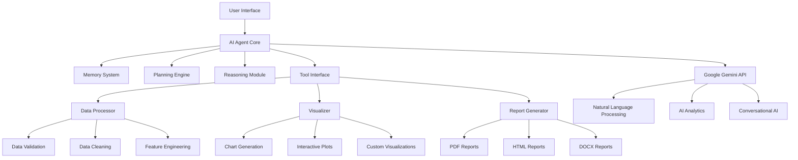
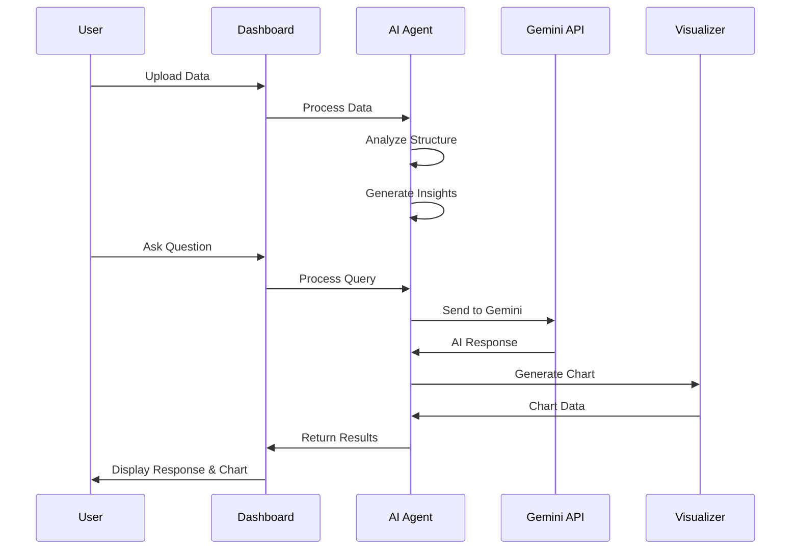
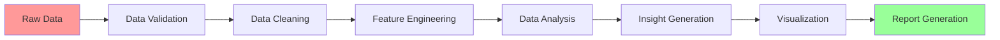
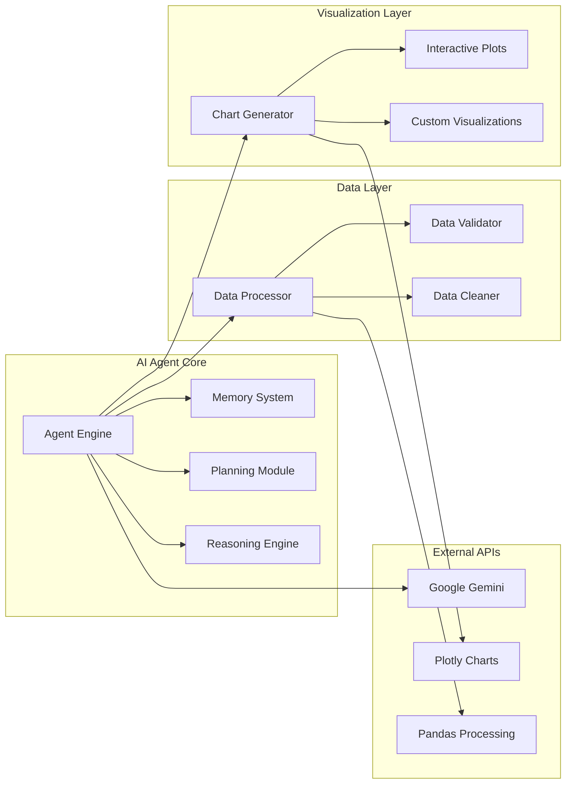
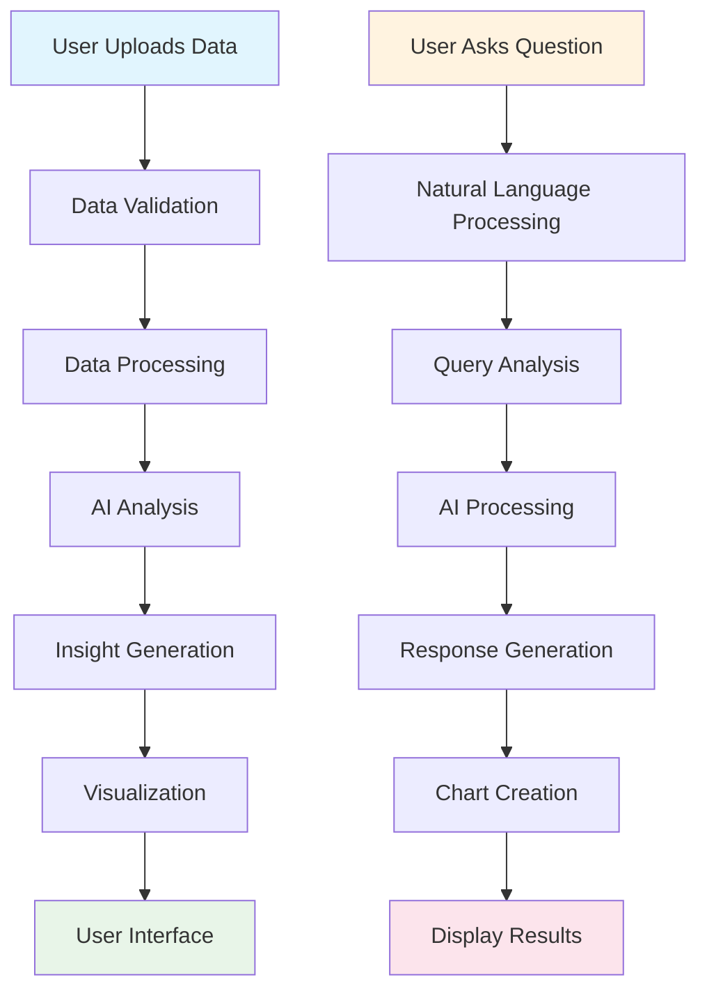

# 🤖 AI Performance Analytics Agent

A comprehensive **Agentic AI** project designed for educational purposes, demonstrating how AI agents can autonomously analyze data, generate insights, and provide intelligent assistance. Built with Python and Streamlit for the **Agentic AI Course**.

## 🎯 Project Focus: Agentic AI Education

This project is specifically designed to teach students about **Agentic AI** concepts:

- **🧠 Memory System**: Persistent memory for learning and context
- **🎯 Planning Engine**: Step-by-step task decomposition
- **🔍 Reasoning Module**: Logical analysis and inference
- **🔧 Tool Interface**: Modular capability system
- **💬 Conversational AI**: Natural language interaction
- **📊 Data Analysis**: Intelligent data processing and insights

## 🏗️ Project Architecture



## 📁 Project Structure

```
ai_agent/
├── main.py                 # Main entry point
├── requirements.txt        # Python dependencies
├── env.example            # Environment variables template
├── README.md              # Project documentation
├── PROJECT_STRUCTURE.md   # Detailed structure documentation
│
├── config/                # Configuration files
│   └── settings.py        # Application settings
│
├── src/                   # Core source code
│   ├── agent.py          # AI Agent implementation
│   ├── data_processor.py # Data processing logic
│   └── visualizer.py     # Data visualization
│
├── dashboards/           # Streamlit dashboard implementations
│   └── professional_dashboard.py  # Main production dashboard
│
├── data/                 # Data storage
│   └── sample_data.csv   # Sample datasets
│
├── reports/              # Generated reports
├── logs/                 # Application logs
├── tests/                # Test files
├── docs/                 # Documentation
├── assets/               # Static assets
└── cache/                # Temporary cache files
```

## 🚀 Quick Start

### 1. Installation

```bash
# Clone the repository
git clone <repository-url>
cd ai_agent

# Install dependencies
pip install -r requirements.txt
```

### 2. Configuration

```bash
# Copy environment template
cp env.example .env

# Edit .env with your API keys
GEMINI_API_KEY=your_gemini_api_key_here
```

Get your free API key from: https://makersuite.google.com/app/apikey

### 3. Run the Application

```bash
streamlit run main.py
```

Visit: http://localhost:8501

## 🎓 Key Features

### 🤖 AI Agent Capabilities



### 📊 Data Processing Pipeline



### 💬 Conversational Interface

- **Natural Language Processing**: Ask questions in plain English
- **Context-Aware Responses**: AI understands your data structure
- **Automatic Visualizations**: Charts generated based on questions
- **Smart Suggestions**: AI recommends relevant questions
- **Chat History**: Persistent conversation memory

### 📈 Advanced Analytics

- **Statistical Analysis**: Comprehensive data insights
- **Trend Detection**: Time-series analysis
- **Correlation Analysis**: Relationship discovery
- **Outlier Detection**: Anomaly identification
- **Predictive Insights**: AI-powered forecasting

## 🔧 Technical Architecture

### Core Components



### Technology Stack

- **Frontend**: Streamlit (Python web framework)
- **AI Engine**: Google Gemini 2.0 Flash
- **Data Processing**: Pandas, NumPy
- **Visualization**: Plotly, Matplotlib, Seaborn
- **Configuration**: Python-dotenv
- **Logging**: Python logging module

## 📋 Usage Guide

### 1. Data Upload

1. **Upload File**: Use the file uploader to add CSV/Excel files
2. **Generate Sample**: Click "Generate Sample Data" for testing
3. **Data Validation**: System automatically validates and cleans data
4. **Preview**: View data structure and statistics

### 2. AI Chat Interface

1. **Ask Questions**: Type natural language questions about your data
2. **Smart Suggestions**: Click suggested questions for quick insights
3. **View Responses**: Get AI-generated insights with explanations
4. **Interactive Charts**: Explore automatically generated visualizations

### 3. Analytics Dashboard

1. **Quick Stats**: View key metrics and statistics
2. **Data Summary**: Understand your data structure
3. **Export Options**: Download reports in multiple formats
4. **Settings**: Configure AI model and preferences

## 🎨 Dashboard Features

### Professional Interface

- **Dark Theme**: Modern, professional appearance
- **Tabbed Navigation**: Organized functionality
- **Responsive Design**: Works on all devices
- **Real-time Updates**: Live data processing
- **Error Handling**: Graceful error management

### Interactive Elements

- **File Upload**: Drag-and-drop interface
- **Progress Indicators**: Real-time processing feedback
- **Chat Interface**: Conversational AI interaction
- **Chart Controls**: Interactive visualizations
- **Export Functions**: Multiple report formats

## 🔍 Example Questions

### Data Exploration
- "What are the key trends in my data?"
- "Which team performed best overall?"
- "Show me the distribution of sales data"
- "Are there any outliers in the performance metrics?"

### Comparative Analysis
- "Compare performance across all teams"
- "What's the relationship between sales and customer satisfaction?"
- "Which quarter had the best results?"
- "How do different metrics correlate?"

### Insights & Recommendations
- "What insights can you provide about this data?"
- "What recommendations do you have for improvement?"
- "What patterns do you notice in the data?"
- "What should I focus on based on this analysis?"

## 🛠️ Development

### Adding New Features

1. **Core Logic**: Add functionality to `src/` modules
2. **Dashboard**: Create new interfaces in `dashboards/`
3. **Configuration**: Update `config/settings.py`
4. **Tests**: Add tests in `tests/` directory

### Testing

```bash
# Run tests
python -m pytest tests/

# Run with coverage
python -m pytest tests/ --cov=src
```

### Logging

Logs are stored in `logs/` directory with different levels:
- **INFO**: General application flow
- **WARNING**: Potential issues
- **ERROR**: Error conditions
- **DEBUG**: Detailed debugging information

## 📊 Data Flow



## 🚀 Deployment

### Local Development

```bash
# Install dependencies
pip install -r requirements.txt

# Set environment variables
export GEMINI_API_KEY=your_key_here

# Run application
streamlit run main.py
```

### Production Deployment

1. **Environment Setup**: Configure production environment variables
2. **Dependencies**: Install all required packages
3. **Data Storage**: Set up persistent data storage
4. **Monitoring**: Configure logging and monitoring
5. **Scaling**: Use Streamlit Cloud or similar platform

## 🤝 Contributing

1. **Fork** the repository
2. **Create** a feature branch
3. **Make** your changes
4. **Test** thoroughly
5. **Submit** a pull request

## 📄 License

This project is licensed under the MIT License - see the LICENSE file for details.

## 🙏 Acknowledgments

- **Google Gemini API** for AI capabilities
- **Streamlit** for the web framework
- **Plotly** for interactive visualizations
- **Pandas** for data processing
- **Agentic AI Course** for educational framework

## 📞 Support

For questions, issues, or contributions:

1. **Issues**: Create an issue on GitHub
2. **Documentation**: Check the docs/ directory
3. **Examples**: See the sample data and usage examples
4. **Community**: Join the Agentic AI course discussions

---

**Built with ❤️ for the Agentic AI Course**

*Empowering students to understand and build intelligent AI agents*